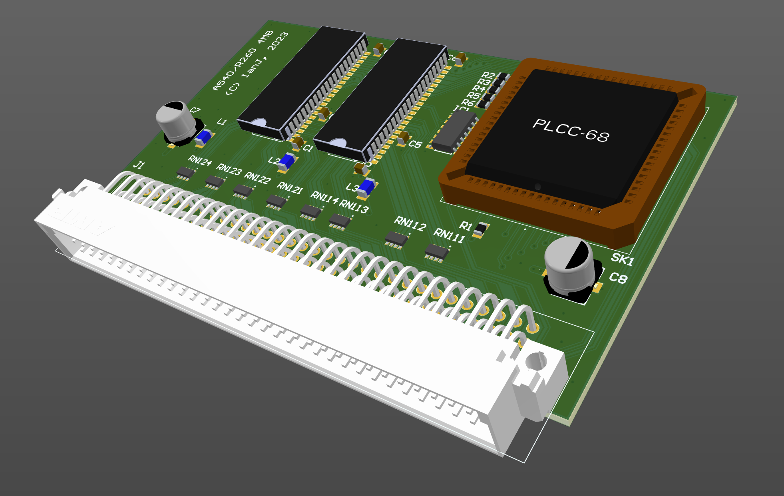

# Acorn A540/R260 4MB RAM card

March 2023

This is my implementation of a 4MB RAM card for Acorn A540 / R260 machines.  It follows Acorn's design as per the schematic in the A540/R260 TRM, but replaces the RAMs with 16bit parts.
It's a four-layer design, using a split power plane for separated RAM VCC.

This has not yet been manufactured / tested!

## Licence

No warranty is provided, and this work is used at your own risk.  

Licenced as CC BY-SA 3.0

Copyright 2023 Ian Jeffray

